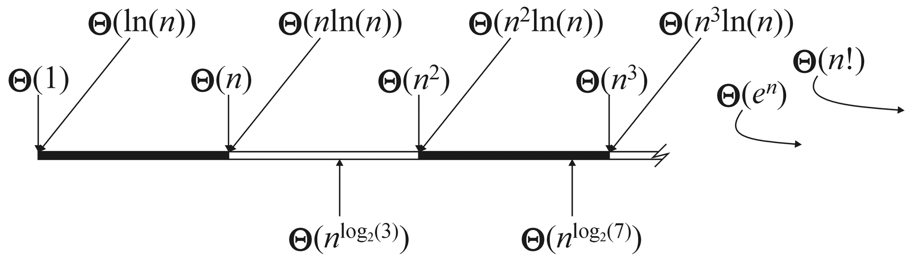
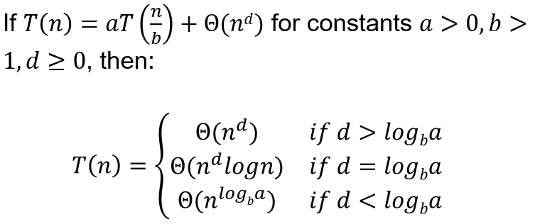
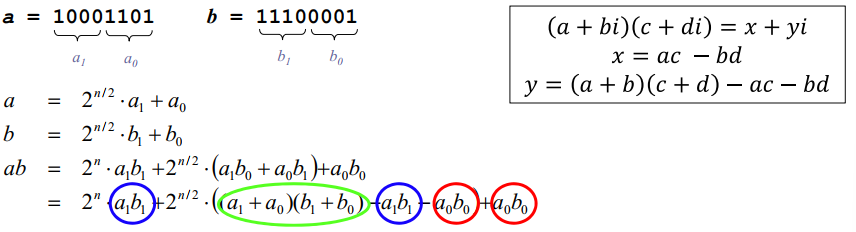
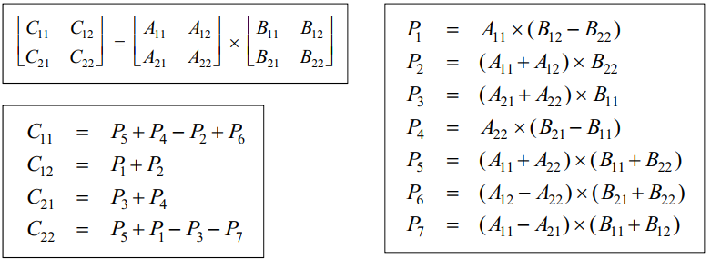

|    Landau Symbol    | limit                                                        | rate of growth |
| :-----------------: | ------------------------------------------------------------ | -------------- |
|   $f(n)=o(g(n))$    | $\lim_{n \rightarrow \infty}\frac{f(n)}{g(n)} = 0$           | $f  < g$       |
|   $f(n)=O(g(n))$    | $\lim_{n \rightarrow \infty}\frac{f(n)}{g(n)} < \infty$      | $f \le g$      |
| $f(n)=\Theta(g(n))$ | $\lim_{n \rightarrow \infty}\frac{f(n)}{g(n)}=c,0<c < \infty$ | $f \sim g$     |
| $f(n)=\omega(g(n))$ | $\lim_{n \rightarrow \infty}\frac{f(n)}{g(n)} = \infty$      | $f>g$          |
| $f(n)=\Omega(g(n))$ | $\lim_{n \rightarrow \infty}\frac{f(n)}{g(n)} > 0$           | $f \ge g$      |

- when $p<q$, $np = o(\ln(n)n^p)$, but $\ln(n)n^p = o(n^q)$

- $(\log n)^k = o(n^ε), ∀k ∈ Z^+, ε ∈ R^+$​  
- $n! \approx \sqrt{2\pi n}(\frac{n}{e})^n$
  - 或者表达为：$ \lim_{n\rightarrow \infty} \frac{n!}{\sqrt{2\pi n}(\frac{n}{e})^n}=1$​
  - 解释了为什么 $n!<n^n$, but $\log(n!)\sim\log(n^n)$

if-else: assume the longest branch runs (worse case complexity)

## recursive algorithms

1. Find a recurrence relation

2. Solve the equation

   - **Guess** a solution, then prove it by **induction**.

   - Substitution: 一直展开式子，直到$S(n) = S(1)+...$

   - Recursion tree: 深度和每层上的开销，求和

   - Master theorem
     - 
     - 可以处理$T(n) = 3T(n/4)+n\log n$, 但无法处理$T(n) = 2T(n/2)+n\log n$​
     - $T(n)=2T(\sqrt{n})+\Theta(\log n)$: Let $n = 2^m, S(m)=T(2^m)$.

> $T(n) = a \cdot T\left(\frac{n}{b}\right) + f(n)$
>
> 其中 $a \geq 1$，$b > 1$，$f(n)$ 是一个正函数，则 $T(n)$ 的渐进上界可以根据以下三种情况中的一种确定：
>
> 1. 如果 $f(n) = O(n^{\log_b a - \epsilon})$ 对某个常数 $\epsilon > 0$ 成立，则 $T(n) = \Theta(n^{\log_b a})$。
> 2. 如果 $f(n) = \Theta(n^{\log_b a})$，则 $T(n) = \Theta(n^{\log_b a} \log n)$。
> 3. 如果 $f(n) = \Omega(n^{\log_b a + \epsilon})$ 对某个常数 $\epsilon > 0$ 成立，且对某个常数 $c < 1$ 和足够大的 $n$，有 $a \cdot f\left(\frac{n}{b}\right) \leq c \cdot f(n)$，则 $T(n) = \Theta(f(n))$。

---

# Divide and Conquer

## Selection

$$
S(n) \le S(n/5)+S(7n/10)+O(n)
$$

## Long multiplication of two integers – Karatsuba’ s algorithm

naive $O(n^2)$

- It does 3 multiplications of digit numbers instead of 4

$$
S(n) = 3S(n/2)+O(n)\\
S(n) = \Theta(n^{\log_23}) = O(n^{1.59})< O(n^2)
$$

## Block matrix multiplication

naive $O(n^3)$

$$
S(n) = 7S(n/2)+O(n^2)\\
S(n) = \Theta(n^{\log_2 7}) = O(n^{2.81})
$$

## Counting Inversions

First sort then count
$$
S(n) = 2S(n/2) + O(n) \\

S(n) = O(n\log n)
$$

## Maximum Subarray

**Goal.** Given array A, find with max $\sum_{k = i+1}^j A[k]$

分成两半，要么全左要么全右要么横跨中间$O(n)$
$$
S(n) = 2S(n/2) + O(n) \\
S(n) = O(n \log n)
$$

## Closest Point Pair