# Complexity Analyze

| Landau Symbol       | limit                                                        | rate of growth |
| ------------------- | ------------------------------------------------------------ | -------------- |
| $f(n)=o(g(n))$      | $\lim_{n \rightarrow \infty}\frac{f(n)}{g(n)} = 0$           | $f  < g$       |
| $f(n)=O(g(n))$      | $\lim_{n \rightarrow \infty}\frac{f(n)}{g(n)} < \infty$      | $f \le g$      |
| $f(n)=\Theta(g(n))$ | $\lim_{n \rightarrow \infty}\frac{f(n)}{g(n)}=c,0<c < \infty$ | $f \sim g$     |
| $f(n)=\omega(g(n))$ | $\lim_{n \rightarrow \infty}\frac{f(n)}{g(n)} = \infty$      | $f>g$          |
| $f(n)=\Omega(g(n))$ | $\lim_{n \rightarrow \infty}\frac{f(n)}{g(n)} > 0$           | $f \ge g$      |

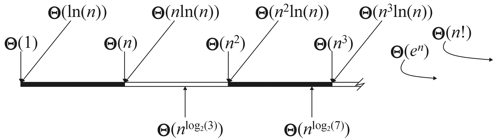

- when $p<q$, $np = o(\ln(n)n^p)$, but $\ln(n)n^p = o(n^q)$

- $(\log n)^k = o(n^ε), ∀k ∈ Z^+, ε ∈ R^+$  
- $n! \approx \sqrt{2\pi n}(\frac{n}{e})^n$
  - 或者表达为：$ \lim_{n\rightarrow \infty} \frac{n!}{\sqrt{2\pi n}(\frac{n}{e})^n}=1$
  - 解释了为什么 $n!<n^n$, but $\log(n!)\sim\log(n^n)$

if-else: assume the longest branch runs (worse case complexity)

## Analyze Recursive algorithms

4 ways to solve a recurrence relation.

### Direction solution

Guess a solution, then prove it by induction.

### Substitution method

一直展开式子，直到$S(n) = S(1)+...$

### Recursion tree method

计算树的深度和每层上的开销

### Master theorem

- 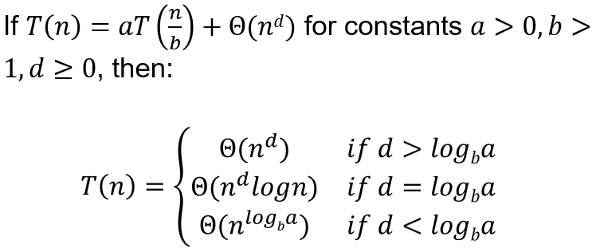
     - 可以处理$T(n) = 3T(n/4)+n\log n$, 但无法处理$T(n) = 2T(n/2)+n\log n$
     - $T(n)=2T(\sqrt{n})+\Theta(\log n)$: Let $n = 2^m, S(m)=T(2^m)$.

> $T(n) = a \cdot T\left(\frac{n}{b}\right) + f(n)$
>
> 其中 $a \geq 1$，$b > 1$，$f(n)$ 是一个正函数，则 $T(n)$ 的渐进上界可以根据以下三种情况中的一种确定：
>
> 1. 如果 $f(n) = O(n^{\log_b a - \epsilon})$ 对某个常数 $\epsilon > 0$ 成立，则 $T(n) = \Theta(n^{\log_b a})$。
> 2. 如果 $f(n) = \Theta(n^{\log_b a})$，则 $T(n) = \Theta(n^{\log_b a} \log n)$。
> 3. 如果 $f(n) = \Omega(n^{\log_b a + \epsilon})$ 对某个常数 $\epsilon > 0$ 成立，且对某个常数 $c < 1$ 和足够大的 $n$，有 $a \cdot f\left(\frac{n}{b}\right) \leq c \cdot f(n)$，则 $T(n) = \Theta(f(n))$。**

---

# Divide and Conquer


## Selection

find the i-th smallest number in a given array.

---

an algorithm that is similar to quick sort:

randomly choose a piviot. on average, each piviot divide the array equally. 

$$
T(n) = T(n/2) + O(n)\\
T(n) = O(n)
$$

But if not random, worse case each pivot only divide out one element. 
$$
T(n) = T(n-1)+O(n)\\
T(n) = O(n^2)
$$

---

an algorithm introduced in calss (I think it is just a method introduced to avoid the worse case in the former QS without using random)

`select(A, i)`

### Algorithm

### Analysis

$$
S(n) = S(n/5)+S(u)+O(n)
$$

- $u$ is the size of whichever partition we recurse on.  

#### show $u \le 7n/10$

- n/10 medians less than x
- each group with median less than x, 3 values in this group less than x
- totally at least 3n/10 values less than x
- similarly, at least 3n/10 values larger than x

Therefore, $u \le 7n/10$ proved, and
$$
S(n) \le S(n/5)+S(7n/10)+O(n)
$$

#### guess and prove $S(n) = O(n)$

suppose $S(n) \le cn$
$$
cn = c(n/5) + c(7n/10) + bn\\
c = 10b
$$


---

## Multiplying complex number – Gauss’ s method
$$
(a+bi)(c+di) = x+yi\\
x = ac-bd \\
y = (a+b)(c+d)-ac-bd
$$

- less multiplication, more addition -> much faster when used **recursively**

## Long multiplication of two integers – Karatsuba’ s algorithm

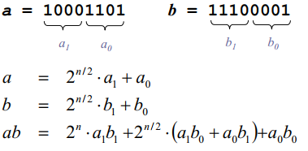

- not faster, still $\Theta(n^2)$

#### use Gauss’ s method

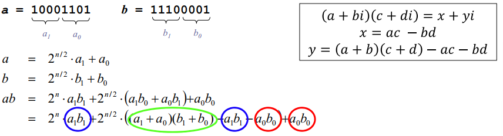

- It does 3 multiplications of digit numbers instead of 4

$$
S(n) = 3S(n/2)+O(n)\\
S(n) = \Theta(n^{\log_23}) = O(n^{1.59})< O(n^2)
$$

---
## Block matrix multiplication

naive, $\Theta(n^3)$

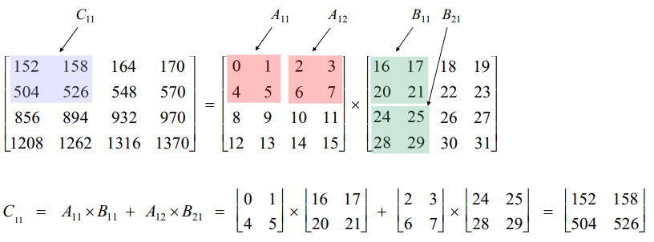
$$
S(n) = 8S(n/2)+O(n^2)\\
S(n) = \Theta(n^3)
$$

- not faster

#### use Strassen’ s algorithm

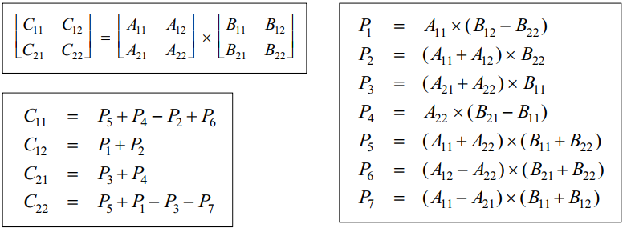
$$
S(n) = 7S(n/2)+O(n^2)\\
S(n) = \Theta(n^{\log_2 7}) = O(n^{2.81})
$$

## Counting Inversions

> CS101 notes/Sort/Merge Sort

- divide the array into 2 halves

**total number of inversions = # in the left half + # in the right half + # between the 2 halves**

### count # between the 2 halves:

##### naively, 每两个都比，$\frac{n^2}{4}$

$$
S(n) = 2S(n/2) + O(n^2) \\

S(n) = O(n^2)
$$

- not faster

##### Sort (which doesn’t change the number of inversions)

merge and count
$$
S(n) = 2S(n/2) + O(n)\\
S(n) = O(n \log n)
$$

> 不要哦从各自的头开始比较，从一个的头和另一个的尾。如果从尾开始的某个数已经比从头开始的某个小，那剩下的就全是Inversion。这应该能做到一个常数级的优化？
>
> 不行。一头一尾 没法把sorted 作为结果

---
## Maximum Subarray

> 在动态规划里也有

**Goal.** Given array A, find with max $\sum_{k = i+1}^j A[k]$

#### Solution with D&C.

divide the array from the middle, the wanted array is either:

- in the right half
- in the left half
- across the 2 halves

##### Find max subarray crossing the midpoint:

在左右各自找，和mid连续的最大subarray

$O(n)$
$$
S(n) = 2S(n/2) + O(n) \\
S(n) = O(n \log n)
$$

#### Solution with DP

> CS101/General Resources/DP
>
> CS101/My Notes/DynamicProgramming
>
> 两个里面都有讲

---

## Closest Point Pair

- 用一条与x轴或y轴垂直的直线，将平面分成两个区域。每个区域点数接近 – $O(n)$ 

  - > see **Dividing points evenly** 

- 最近点可能在：

  - 左
  - 右
  - 横跨左右

- 找横跨左右的最近点 – $O(n)$ 

  - > **see Sorting R points by y coordinate** 

  - $\delta = \min(左边最近点的距离，右边最近点的距离)$ 

  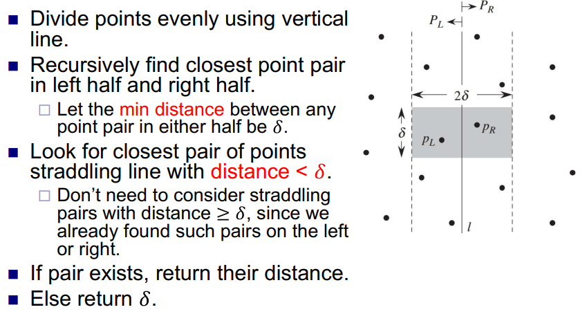


$$
S(n) = 2S(n/2)+O(n)\\
S(n) = O(n\log n)
$$

### Sparsity lemma

### Dividing points evenly

在算法最初，先把所有的点以某一个维度sort $O(n \log n)$

然后每次从这个sort好的array，中分数量

– $O(n)$

### Sorting R points by y coordinate

算法初sort $O(n \log n)$

## Polynomial multiplication – FFT

naively, multiplying 2 polynomials each of degree $n$ takes $O(n^2)$ time.

can also be solve using ***Karatsuba’s method***, but higher time complexity $\Theta(n^{\log_2 3})$, while ***FFT*** has $\Theta(n\log n)$

> see CS101/PA/PA2/prob1

多项式的系数表示

**point-value representation**：$n-1$次的多项式可以通过$n$个不同的点取值来确定

那么求$C(x)$相当于：求C在 $x=x_k$ 时的取值，那么如果已知A和B 在 $x=x_k$ 的取值，直接 $C(x_k) = A(x_k)B(x_k)$ for all $k$

Therefore,  $C(x) = A(x)B(x)$.


---

# Linear time sorting

基于比较的排序，理论上时间复杂度的下限就是 $O(n \log n)$

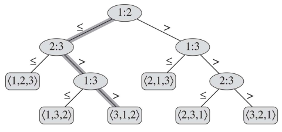

而非基于比较的排序理论下限 $O(n)$，因为至少要把输入读一遍并且输出

## Counting sort

**Requirement**: integers in the range 0 to k

- In (a), contains number of occurrences of each input value in  A

- 计算prefix sum也就是图(b)中的C

- iterate through in reverse order.

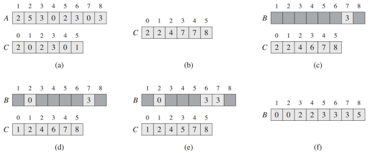

$\Theta(n+k)$

if $k=O(n)$, then complexity is $\Theta(n)$

stable -> can be used for radix sort

## Radix sort

Sort digit by digit, from least to most significant digit.(从最低位起sort，必须stable算法)

- Suppose we sort $n$ $d$-digit numbers, where each digit is between 0 to k-1. Then radix sort takes $O(d(n+k))$​ time.

- Given $n$ $b$-bit numbers and $r\le b$. Radix sort takes $O(\frac{b}{r}(n+2^r))$​ time.
  - Break the $b$ bits into blocks of $r$ digits, having values between 0 and $2^r-1$​

- Setting $r = \min(\lfloor \log n \rfloor , b)$ minimizes the running time $\Theta(\frac{b}{r}(n+2^r))$​

- radix sort is efficient when there are many short numbers, but not when there are a few long numbers.

---
# Greedy

## Selecting Breakpoints

gas refueling problem

save refuel time

##### **proof.** 

the greedy algorithm always choose to go as far as possible, so OPT can't go further than Greedy.

If $g_{r+1} > f_{r+1}$, than OPT must require one more step than Greedy, then it's not optimal. Contradicts.

## Coin Changing

**Theorem**. Greedy is optimal for U.S. coinage: 1, 5, 10, 25, 100.

##### **proof.**

find max vlaue of coins in any OPT
prove that without the least max coin, can't achieve opt

Such greedy algorithm **doesn't work for all** coin combinations.

**Observation**. Greedy algorithm is sub-optimal for US postal denominations: 1, 10, 21, 34, 70, 100, 350, 1225, 1500 .

## Interval scheduling

**Goal**. Given a set of intervals, pick the largest number of non-overlapping ones.

- sort by finishing time
- choose ==**earliest finishing**== one that doesn’t overlap previous selected interval

Overall $O(n \log n)$ time.

##### **proof.**

greedy is not worse than the optimal solution. prove by **induction**

Greedy solution $S$, optimal solution $T$​.
Let $s_k$ and $t_k$ be k’th interval in $S$ and $T$, resp.
Let $fin(i)$ be finishing time of an interval $i$.
**Claim**. $fin(s_k ) \le fin(t_k )$ for all $k$

## Interval coloring problem

**Goal**. schedule all the intervals on some number of resources. Intervals on the same resource cannot overlap. Minimize the number of resources used.

**Observation**. Suppose $k$ intervals intersect at some time point. Then the optimal schedule needs at
least $k$ resources.
**Def**. ***Depth*** of a set of intervals is the max number of intervals that intersect at any time.

**Corollary**. Let $d$ be the depth of a set of intervals, and suppose we find a schedule using $d$ resources. Then the schedule is optimal.

- Sweep through intervals in order of ==**increasing start time**==.
- For each interval, assign it to smallest resource not already assigned to an intersecting interval.

**Claim**. Let the set of intervals have depth d. Then the algorithm uses d resources

## Scheduling to Minimizing Lateness

- **==Earliest deadline first==** -> optimal

**Observation**. There exists an optimal schedule with no idle time.

**Observation**. The greedy schedule has no idle time.

**Def**. An ***inversion*** in schedule S is a pair of jobs i and j such that: i < j but j scheduled before i. *(I suppose the i and j here means deadline time)*

**Observation**. Greedy schedule has no inversions.

an existing inversion always make the lateness larger.

**Claim**. Swapping two adjacent, inverted jobs reduces the number of inversions by one and does not increase the max lateness.

##### **Pf**. Greedy schedule $S$ is optimal.

Define $S*$ to be the optimal solution. Then $S*$ must has the fewest number of inversions.

- Can assume $S*$ has no idle time.
- If $S*$ has no inversions, then $S = S*$.
- If S* has an inversion, let i-j be an adjacent inversion.
  - swapping i and j does not increase the maximum lateness and strictly decreases the number of inversions
  - this contradicts definition of $S*$


## Caching

cache: fast, closer to CPU core, not quite large

- store only the most important data in cache

- caching algorithm to decide which data to store

### Optimal Offline Caching

***offline***: at the beginning, **know** which data are going to be accessed

assume only one layer of cache
Intuition. Can transform an unreduced schedule into a reduced one with no
more evictions.

***cache hit***: in cache
***cache miss***: if not find in cache, go to memory, load in into cache, choose to evict some existing item.

**Goal.** Eviction schedule that minimizes number of evictions.

**==Farthest-in-future==.** Evict item in the cache that is not requested until farthest in the future

- FF is optimal offline eviction algorithm


##### **Proof.**

**Def**. A ***reduced*** schedule is a schedule that only inserts an item into the cache in a step in which that item is requested.

**Intuition.** Can transform an unreduced schedule into a reduced one with no more evictions. *(There is no need to prepare ahead of time)*

> see proof on ppt

prove by induction

**Lemma.** If the optimal reduced schedule $S$ share the same first $j$ requests as $S_{FF}$, then they also share the same $j+1$​ request. 

pf: Consider $(j+1)$ st request $d = d_{j+1}$


- **Case 1**: ($d$ is already in the cache). $S' = S$

- **Case 2**: ($d$ is not in the cache and $S$ and $S_{FF}$ evict the same element). $S' = S$

- **Case 3**: ($d$ is not in the cache; $S_{FF}$ evicts $e$; $S$ evicts $f \ne e$).

  From request j+2 onward, we make S’ the same as S, but this becomes impossible when e or f is involved

  - **Case 3a**: $g = e$

  - **Case 3b**: $g \ne e, g\ne f$

  - **Case 3c**: $g = f$

### Online Caching

***Online (reality)***: requests are not known in advance.

- **LIFO**. Evict page brought in most recently.
  - LIFO is arbitrarily bad: For $n$ requests, it may do $O(n)$ times more loads than optimal.

- **LRU**. Evict page whose most recent access was earliest
  - LRU is k-competitive: it does times more loads than the optimal eviction algorithm

## Huffman Coding

**prefix-free** codes -> unique decoding
==Huffman encoding is an optimal prefix-free code==

$n$ different chars to encode -> $O(n^2)$ time

##### Pf. optimal


---

# Dynamic Programming

## Optimal substructure

After making a decision, the rest of the solution should be optimal for the rest of the problem.

Not all problems have optimal substructure.

## Weighted Interval Scheduling

**Goal**. Pick a set of non-overlapping intervals with the largest combined weight.

- Given interval $I_j$, let $p(j)$ be the maximum index $k$ s.t. $I_k$ finishes before $I_j$​ starts.
  finishes before starts.

- Let $OPT(j)$ be the weight of a max weight non-overlapping subset of $I_1,\dots,I_j$.

> see CS101/LectureNotes/dp
>
> or CS101/mynotes

$$
OPT(j) \;=\;
\begin{cases}
\;0 & \text { if } j = 0 \\[.3em]
\;\max \left \{ \, OPT(j-1), \; v_j + OPT(p(j)) \, \right \} & \text { if } j > 0 \\
\end{cases}
$$


## Segmented Least Squares

- Points lie roughly on a sequence of several line segments.

- Given n points in the plane $(x_1 , y_1 ), (x_2 , y_2 ) , . . . , (x_n , y_n )$ with $x_1 < x_2 < ... < x_n$ , find a sequence of lines that minimizes $E + c L$

  - E: the sum of the sums of the squared errors in each segment
  - L: the number of lines
  - c: some positive constant

$OPT(j)$ = minimum cost for points $p_{1} , p_{i+1} , . . . , p_{j}$ .

$e(i, j)$ = minimum sum of squares for points $p_{i} , p_{i+1} , . . . , p_{j}$​ .
$$
OPT(j) \;=\;
\begin{cases}
0 & \text { if } j = 0 \\
\max_{1\le i\le j} \left \{ e(i,j)+c+OPT(i-1) \right \} & \text { otherwise}
\end{cases}
$$
**Running time**. $O(n^3)$


## Subset Sum

背包问题的变种

**Goal**. Each job $i$ takes $w_i$ resource. We have $W$ resources. Find a set of jobs $S\subseteq \{1,\dots n\}$ to maximize $\sum_{i \in S} w_i$, subject to $\sum_{i\in S}w_i \le W$​.

**Greedy algorithm**. Sort items from largest to smallest. Insert items sequentially, as many as possible. -> Always achieves at least 1/2 the max possible sum.

**DP**. Let $OPT(i, W’)$ be max weight of a subset $S\subseteq \{w_1,\dots,w_i\}$, subject to $\sum_{i\in S}w_i \le W'$.
$$
OPT(i,W')=\max(OPT(i-1,W'),w_i+OPT(i-1,W'-w_i))
$$
Time complexity and memory complexity are both $O(nW)$.

## Matrix-chain multiplication

choose which point to break on

**Goal**. Given a sequence $A_1,A_2,\dots,A_n$ of matrices, where $A_i$ has dimensions $p_{i-1} \times p_i$, for $i=1,…n$, compute the product $A_1\times A_2\times \dots\times A_n$​ in a way that minimizes the cost.

Let $M(i,j)$ be the smallest time to multiply matrices of $A_i \times A_{i+1}\times \dots\times A_j$​

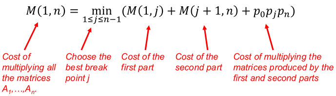

### Table method to solve the DP space

关键在于先找出DP的前后依赖关系

Total time cost: $O(n^3)$

Space complexity: $O(n^2)$

## Problems with(out) optimal substructure

##### Shortest paths has optimal substructure

$d(x,y) = \min_{(z,y)\in E}(d(x,z)+w(z,y))$​

shortest path from x to y is to take shortest path from x to one of y’s neighbors, then go to y

##### Longest simple path does not have optimal substructure.

When sub-solutions aren’t combinable, we say the subproblems aren’t independent

## Longest common subsequence

Remove the last letter of the long string

- Let $S[1,i]$ be the first i letters of a string S, and $S[i]$ be the $i$’th letter of S.
  - Let $S[i,0]$ be the empty string, for any i.

- Let $LCS(X[1,i], Y[1,j])$ be the LCS of $X[1,i]$ and $Y[1,j]$.
- Let $c(i,j)$ be the length of $LCS(X[1,i], Y[1,j])$.

$$
c[i,0] = 0 \text{ for all i}\\
c[0,j] = 0 \text{ for all j}\\
c[i,j]=
\begin{cases}
c[i-1,j-1]+1 & \text{if }X[i]=Y[j]\\
\max(c[i-1.j,c[i,j-1]])& \text{if }X[i]\ne Y[j]\\
\end{cases}
$$

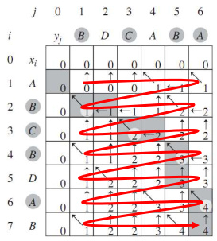

Time complexity and memory complexity are both $O(mn)$​.

---

# Network Flow

***duality*** between ***max flow*** and ***min cut***

The weight of the edge stands for its capacity.

## Flows

#### ***s-t flow***

- Each edge can have an amount of flow less than its capacity.
  - $0\le f(e)\le c(e)$ for each $e \in E$

- The sum of in-flow equals the sum of out-flow (except the source and sink)
  - $\sum_{e \text{ in to } v} f(e) = \sum_{e \text{ out of } v} f(e) $ for each $v \in C - \{s, t\}$

#### ***value*** of a flow $f$

$$
v(f) = \sum_{e \text{ out of } s }f(e)
$$


### Greedy

- 单走一条source 到 t 的路径，取上面所有edge的剩余的capacity的最小值作为f(e)

- 重复此步骤直到stuck

not always optimal

- 局部最优无法达到全局最优

undo to go out of the trapped decision

### Residual Graph


***Residual capacity***:

***Augmenting Path***: a simple $s-t$ path P in the residual graph $G_f$​.

***Bottleneck capacity*** of an augmenting path P is the minimum residual capacity of any edge in P

**Claim**: After augmentation, f is still a flow.

### Ford-Fulkerson Algorithm

可以反悔的greedy

如果没有$e^R$这条反向edge每次循环后的添加，就等于纯粹的greedy

## Cuts

只算出去的，进来的不用抵消

An ***s-t cut*** is a partition (A, B) of V with $s \in A$ and $t ∈ B$​.

The ***capacity*** of a cut (A, B) is: $cap(A,B) = \sum_{e \text{ out of A }}c(e)$


### Flow value lemma

Let v be any vlow, and let (A, B) be any s-t cut.
Then, the net vlow sent across the cut is equal to the amount leaving s.
$$
\sum_{e \text{ out of A }}f(e) - \sum_{e \text{ in to A }}f(e) = v(f)
$$


### Weak Duality

Let f be any flow, and let (A, B) be any s-t cut. Then the value of the flow is at most the capacity of the cut.

**Corollary.** Let f be any flow, and let (A, B) be any cut.
If v(f) = cap(A, B), then f is a max flow and (A, B) is a min cut.

the equivalence of the following three conditions for any flow f:
- There exists a cut (A, B) such that v(v) = cap(A, B).
- Flow v is a max vlow.
- There is no augmenting path relative to v.

## Choosing Good Augmenting Paths

**Assumption.** All capacities are integers between 1 and C.


n 是所有edge capacity之和？

Running time of Ford-Fulkerson is $O(mnC)$​​.

---

## Applications / reductions

### Bipartite Matching

Given an undirected graph $G = (V,E)$​, $M\subseteq E$​ is a ***matching*** if each node appears in at most one edge in $M$​​.
***Max matching***: find a max cardinality matching.

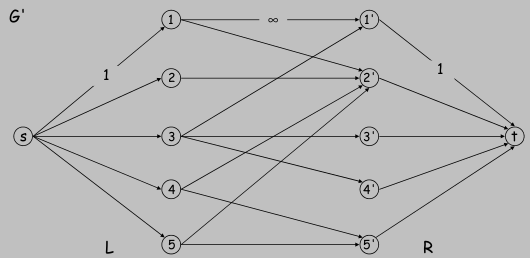

**Theorem**. ==Max cardinality matching in G = value of max flow in G'==

### Perfect Matching (marriage)

A matching M ⊆ E is ***perfect*** if each node appears in exactly one edge in $M$​.

**Marriage Theorem**. Let $G = (L ∪ R, E)$ be a bipartite graph with $|L| = |R|$. Then, $G$ has a perfect matching iff $|N(S)| ≥ |S|$ for all subsets $S ⊆ L$​.

### Edge Disjoint Paths

**Def**. Two paths are ***edge-disjoint*** if they have no edge in common.

**Disjoint path problem**. Given a digraph $G = (V, E)$​ and two nodes s and t, find the max number of edge-disjoint s-t paths.

**Max flow formulation**: assign unit capacity to every edge.

**Theorem**. ==Max number edge-disjoint s-t paths = max flow value==

### Network Connectivity

**Network connectivity**. Given a digraph $G = (V, E)$ and two nodes s and t, find min number of edges whose removal disconnects t from s.
**Def**. A set of edges $F ⊆ E$​ disconnects t from s if all s-t paths uses at least on edge in F.

**Theorem**. ==The max number of edge-disjoint s-t paths = the min number of edges whose removal disconnects t from s==

### Circulation with Demands

For each $v \in V$: $\sum_{e\text{ into }v}f(e)-\sum_{e\text{ out of }v}f(e) = d(v)$​  

**Circulation problem**: given $(V, E, c, d)$, does there exist a circulation?

**Necessary condition**: sum of supplies = sum of demands.

$\sum_{v:d(v)>0}d(v) = \sum_{v:d(v)<0}-d(v)$

#### **Max flow formulation.**

- Add new source s and sink t.
- For each v with d(v) < 0, add edge (s, v) with capacity -d(v).
- For each v with d(v) > 0, add edge (v, t) with capacity d(v).

**Claim**: ==G has circulation iff G' has max flow of value D==.

**Integrality theorem**. If all capacities and demands are integers, and there exists a circulation, then there exists one that is integer-valued.

**Characterization**. Given $(V, E, c, d)$, there does not exists a circulation iff there exists a node partition $(A, B)$ such that Σ v∈B d v > cap(A, B)

### Circulation with Demands and Lower Bounds

Edge capacities $c(e)$ and lower bounds $l(e), e ∈ E$​.

For each $e\in E$: $l(e) \le f(e) \le c(e)$

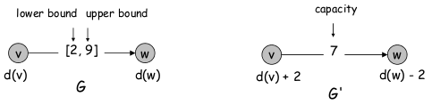

**Theorem**. There exists a circulation in G iff there exists a circulation in G'. If all demands, capacities, and lower bounds in G are integers, then there is a circulation in G that is integer-valued.

---

# NP, reductions

**Def.** P is the set of all problems that can be solved by a polytime algorithm.

## NP = Nondeterministic polynomial time.

**Def**. NP is the class of problems for which the solvability of an instance can be verified in polynomial time. (未知是否有多项式时间的解，但是解的可行性可以在多项式时间内得到验证)


- To show a problem is in P, give an algorithm solving the problem that runs in polynomial time.

- To show a decision problem is in NP, give a polynomial time verifier for the problem satisfying the properties on the previous slide.


1. 4-coloring is in NP

2. Factoring is in NP

3. Traveling salesman is in NP

4. k-Clique is in NP

5. **All problems in P are in NP**

  

6. Primes is in NP (Pratt certificates https://en.wikipedia.org/wiki/Primality_certificate)

## Incorrect verifiers

1. Always outputs 1, regardless of y.
2. Always output 0, regardless of y.
3. Check all subsets of k nodes. If any form a clique, output 1, else output 0. -> not poly-time

## P vs NP

$P \subseteq NP$

But we don’t know whether $NP \subseteq P$.

That is, we don’t know whether $P = NP$


## Reduction

Let A and B be two decision problems.
Let X and Y be the set of yes instances for A and B, resp.
If the mapping function from $A$ to $B$ runs in polynomial time, then it’s a ***polynomial time reducti***on, and we write $A \le_P B$​.

**Thm 1**. Let A, B and C be three problems, and suppose $A \le_P B$ and $B \le_P C$. Then $A \le_P C$


## NP-completeness

**Def**. A problem A is NP-complete (NPC) if the following are true

- $A \in NP$
- Given any other problem $B \in NP, B \le_P A$

### SAT = satisfiable Boolean formulas

Given a Boolean formula, is there any setting for the variables which makes the formula true?

Steve Cook and Leonid Levin proved around 1970 that **SAT is NP-complete**.

**Cook-Levin theorem** says 2 things:

1. SAT $\in NP$
2. Every NP problem reduces to SAT. I.e. every problem A in NP can be mapped to an SAT formula in polytime, such that
   - If A is true, then 𝜙 is satisfiable.
   - If A is false, then 𝜙 is not satisfiable.


For every problem in the picture, if A points to B, it means $A \le_P B$.


**Thm**. Given two NP problems A and B, suppose A is NP-complete, and $A \le_P B$. Then B is also NP-complete.

**Thm 2**. Suppose a problem $A$ is NP-complete, and $A \in P$. Then $P=NP$.

**Cor**. Suppose a problem A is NP-complete, and $A \notin P$. Then for any NP-complete problem B, $B \notin P$

#### **To prove a problem A is NP-complete**: 

1. Prove that problem A is in NP by showing:
   - poly-size certificate
   - poly-time certifier
2. Choose a problem B in NP-Complete to reduce from
3. Construct poly-time many-one reduction f that maps instances of problem A to instances of problem B
4. Prove the correctness of reduction
   - x is a yes-instance of problem A $\to$ f(x) is a yes-instance of problem B
   - f(x) is a yes-instance of problem B $\to$ x is a yes-instance of problem A
     - or: x is a no-instance of problem A $\to$ f(x) is a no-instance of problem B

## Beyond NP

**co-NP.** All problems whose “complement” is in NP

- E.g. GRAPH-ISO$\in$NP, so GRAPH-NONISO$\in$co-NP

## Reduction

### Reducing 3-CNF-SAT to CLIQUE

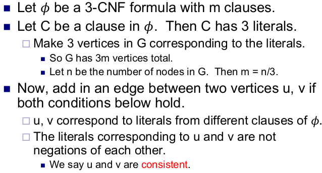

### Reducing 3-CNF-SAT to SUBSET-SUM

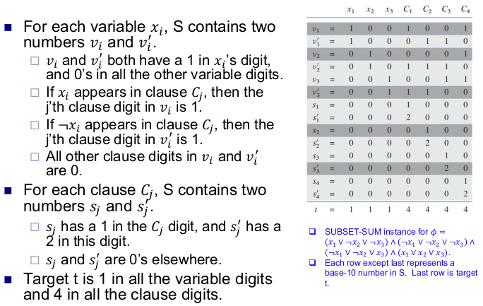

---

# Extending Tractability

Suppose I need to solve an NP-complete problem in poly-time:

**Must sacrifice one of three desired features.**

- Solve problem to optimality.
- Solve problem in polynomial time.
- Solve arbitrary instances of the problem.

This lecture. **Solve some special cases of NP-complete problems.**

***Vertex cover***： Given a graph $G = (V, E)$ and an integer $k$, is there a subset of vertices $S ⊆ V$ such that $| S | ≤ k$, and for each edge $(u, v)$ either $u ∈ S$ or $v ∈ S$ or both?

## finding small vertex covers

**Claim**. Let (u, v) be an edge of G. G has a vertex cover of size ≤ k iff at least one of G − { u } and G − { v } has a vertex cover of size ≤ k − 1.

**Claim**. If G has a vertex cover of size k, it has ≤ k (n − 1) edges

**Claim**. The following algorithm determines **if G has a vertex cover of $size ≤ k$ in $O(2^k kn)$ time.**

```
Vertex-Cover(G, k) {
	if (G contains no edges)	return true
	if (G contains ≥ kn edges) 	return false
	
	let (u, v) be any edge of G
	a = Vertex-Cover(G - {u}, k-1)
	b = Vertex-Cover(G - {v}, k-1)
	return a or b
}
```

Running time:

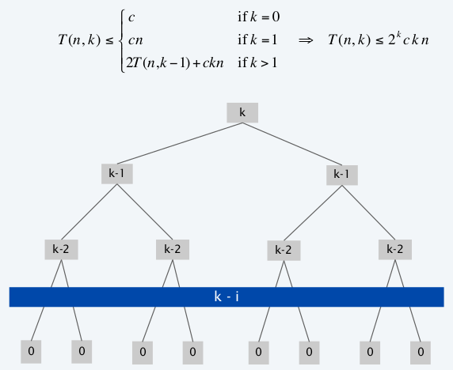

---

## Solving NP-hard problems on trees

independent set on general graph is NP-problem.

### independent set on trees

**Independent set on trees.** Given a tree, find a maximum cardinality subset of nodes such that no two share an edge.

**Key observation.** If v is a leaf, there exists a maximum size independent set containing v.

**Theorem.** The following greedy algorithm finds a maximum cardinality independent set in forests (and hence trees).

```
Independent-Set-In-A-Forest(F) {
	S ← φ
	while (F has at least one edge) {
		Let e = (u, v) be an edge such that v is a leaf
		Add v to S
		Delete from F nodes u and v, and all edges
		incident to them.
	}
	return S
}
```

O(n) time

### Weighted independent set on trees

**Weighted independent set on trees**. Given a tree and node weights $w_v > 0$, find an independent set S that maximizes $Σ_{v ∈ S} w_v$ .

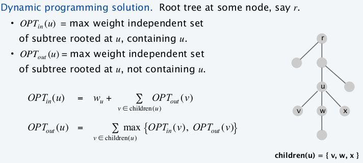

---

## Circular arc coverings

Weak duality: number of colors ≥ depth.

### (Almost) transforming circular arc coloring to interval coloring

**Circular arc coloring.** Given a set of n arcs with depth d ≤ k, can the arcs be colored with k colors?

**Equivalent problem**. Cut the network between nodes $v_1$ and $v_n$ . The arcs can be colored with $k$ colors iff the intervals can be colored with $k$ colors in such a way that **“sliced” arcs have the same color**.

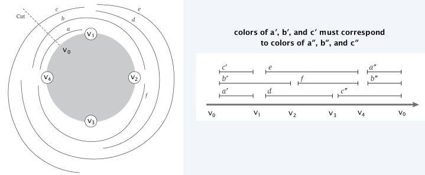

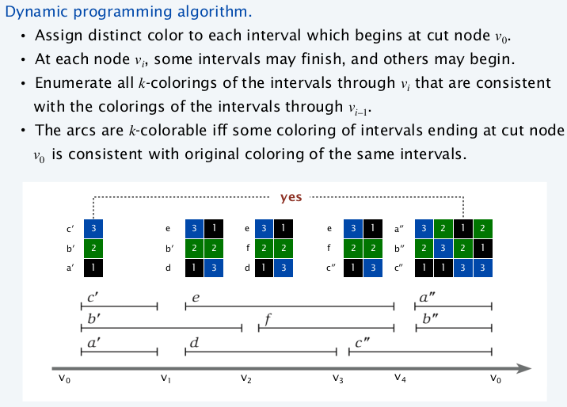

**Running time.** $O(k! \cdot n)$

---

## vertex cover in bipartite graphs

**Weak duality.** Let M be a matching, and let S be a vertex cover. Then, $| M | ≤ | S |$.

**Theorem**. [König-Egerváry] In a **bipartite** graph, the max cardinality of a matching is equal to the min cardinality of a vertex cover.
$$
\text{min cut} \stackrel{\text{strong duality}}{=} \text{max flow} \stackrel{\text{bipartite}}{=} \text{max matching} \stackrel{\text{weak duality and bipartite}}{=} \text{min vertex cover}
$$


没懂 有点晕晕了


# cal Search

Solving NP-hard problems 

## Gradient descent 梯度下降

**Vertex cover**. Given a graph G = (V, E), find a subset of nodes S of minimal cardinality such that for each (u, v) ∈ E, either u or v (or both) are in S.
**Neighbor relation**. $S ∼ Sʹ$ (S is a neighbor of S’) if S ʹ can be obtained from S by adding or deleting a single node. Each vertex cover S has at most n neighbors.

**Local optimum** 局部最优无法达到全局最优

**Gradient descent.** Let S denote current solution. If there is a neighbor S ʹ of S with strictly lower cost, replace S with the neighbor whose cost is as small as possible. Otherwise, terminate the algorithm.

可以做到局部最优，但不一定是全局最优

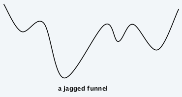

## Metropolis algorithm

大多数时候朝“downhil”方向走，但偶尔 “go uphills” to break out of local minima

**Metropolis algorithm.**

- Given a fixed temperature T, maintain current state S.
- Randomly perturb current state S to new state $S ʹ ∈ N(S)$.
- If $E(S ʹ) ≤ E(S)$, update current state to $S ʹ.$
Otherwise, update current state to $S ʹ$ with probability $e ^{- ΔE / (kT)}$ , where $ΔE = E(S ʹ) – E(S) > 0.$

这个概率函数是基于一个物理原理？***Gibbs-Boltzmann function***

但还是有小概率离开global optimal 反而跑到 local optimal去了

**Simulated annealing.**

- T large ⇒ probability of accepting an uphill move is large.
- T small ⇒ uphill moves are almost never accepted.
- Idea: turn knob to control T.
- Cooling schedule: T = T(i) at iteration i.

一开始的时候 T 较大，allows to explore the whole graph.

gradually, lower T -> smaller probability of leaving a good solution

---

## Hopfield neural networks

**Intuition**. If $w_{uv} < 0$, then $u$ and $v$ want to have the same state; if $w_{uv} > 0$ then $u$ and $v$ want different states.

**Def.** With respect to a configuration $S$, edge e = (u, v) is ***good*** if $w_e 𐄂 s_u 𐄂 s_v < 0$. That is, if $w_e < 0$ then $s_u = s_v$ ; if w e > 0, then s u ≠ s v .

**Def**. With respect to a configuration S, a node u is ***satisfied*** if the weight of incident good edges ≥ weight of incident bad edges. 
$$
\sum _{e=(u,v)\in E} w_es_us_v\le 0
$$
**Def**. A configuration is ***stable*** if all nodes are satisfied.

**Goal**. Find a stable configuration, if such a configuration exists.

**State-flipping algorithm.** Repeated flip state of an unsatisfied node.


每次 flip 会导致 从$\sum _{e=(u,v)\in E} w_es_us_v\le 0$ 变为 $\sum _{e=(u,v)\in E} w_es_us_v\ge 0$ (因为逆转会导致所有原来的bad edge 变成good edge 而good 变成bad)

**Theorem**. The state-flipping algorithm terminates with a stable configuration after at most $W = Σ _e | w_e |$​ iterations. – **but not ploy-time**

---

## Maximum cut

**Single-flip neighborhood**. Given a cut $(A, B)$​, move one node from A to B, or one from B to A if it improves the solution.

-> gives a locally optimal solution

**Theorem**. Let $(A, B)$ be a locally optimal cut and let $(A*, B*)$ be an optimal cut. Then $w(A, B) ≥ ½ ~Σ _e w_e ≥ ½ ~w(A*, B*)$.

**Local search**. Within a factor of 2 for MAX-CUT , but not poly-time!

**Big-improvement-flip algorithm.** Only choose a node which, when flipped, increases the cut value by at least $\frac{2ε}{n} w(A, B)$​

**Claim**. Upon termination, big-improvement-flip algorithm returns a cut (A, B) such that $(2+\epsilon) w(A,B) \ge w(A*,b*)$.

**Claim**. Big-improvement-flip algorithm terminates after O(ε -1 n log W) flips, where  W = Σ e w e .

- 可以减少循环数量，但是使结果离最优更远

---

# Randomized algorithms

A ***Las Vegas randomized algorithm*** always produces the right answer. But it’s running time can vary depending on its random choices.

A ***Monte Carlo algorithm*** always has the same running time. But it sometimes produces the wrong answer, depending on its random choices.

## Max-Cut

Given a graph G, split vertices into two sides to maximize the number of edges between the sides.

- Max-Cut is NP-complete.

- have randomized Monte Carlo 2-approximation algorithm

**Put each node in a random side with probability ½**

**Lemma**. In a graph with e edges, the algorithm produces a cut with expected size e/2.

## Quicksort

worse case $T(n) = O(n^2)$

best case (pivot always in the middle half) $T(n) \le T(n/4)+T(3n/4)+n-1$, $T(n) = O(n\log n)$

### RQuicksort

random quicksort

## Hashing

### Closed addressing

chained table deal with collision

load factor

### Universal hashing

- Instead of using a fixed hash function, universal hashing uses a random hash function, chosen from some set of functions H

- Say H is a universal hash family if for any keys $x \ne y$
  $$
  Pr_{h\in H} [h(x)=h(y)]=1/m
  $$
  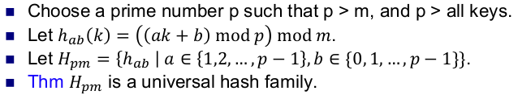

### Perfect hashing

2 layers of hash table. all the hash functions have different hash parameters (a, b), but in the same set of universal hash function.

ensure no collisions in the secondary hash table. if collision, choose different hash parameters and hash again.

level 2 table size = $n^2$

**Lemma**. Suppose we store n keys in a hash table of size m = n 2 using universal hashing. Then with probability ≥ 1/2 there are no collision.

**Lemma**. Suppose we store n keys in a hash table of size m=n. Then the secondary hash tables use space $E\sum^{m-1}_{j=0}n_j^2 \le 2n$, where $n_j$ is the number of keys hashing to location j.

## Approximate sets

***Bloom filter***: a data structure that can implement a set

- It only keeps track of which keys are present, not any values associated to keys.
- It supports insert and find operations.
- It doesn’t support delete operations
- use less memory than hash tables or other ways of implementing sets
- approximate:
  - It can produce *false positives*: it says an element is present even though it’s not.
  - it doesn’t produce *false negatives*: if it says an element isn’t present, then it’s not.


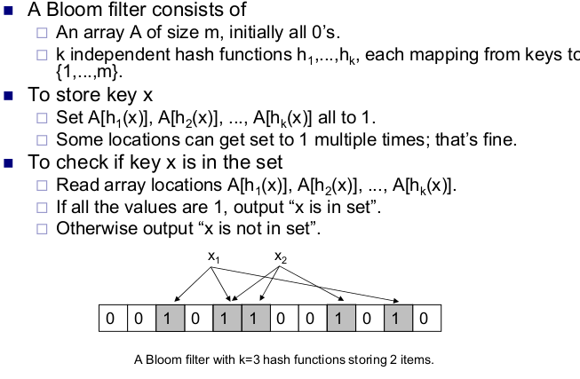

#### False positive probability

- k (number of hash functions)
- m (size of table)
- n (number of keys inserted)

Fix any position i.

$p=P(\text{i still 0 after inserting n items})=(1-1/m)^{nk}$

$f = P(\text{get a false positive}) = (1-p)^k \approx (1-e^{-\frac{nk}{m}})^k$

optimal $k = \frac{n \ln (2)}{n}$

### Improvements to kind of ‘delete’

not always record ‘1’, but increase the value by 1. When delete, decrease the value by 1.

- so there may be 2, 3,… that indicates the ‘count’ of how many times this place is used
- problem
  - if use only a few bits for this ‘count’, will overflow -> 0 again
  - if more bits, more memory cost

## String equality and fingerprinting

Let Alice and Bob’s databases be the bit sequences $(a_1 ,...,a_n )$ and $(b_1 ,...,b_n )$.

The fingerprint $F(a)=a \mod p$​, for a specially chosen prime number p.

Since F(a) < p, transferring the fingerprint only takes O(log p) bits, instead of n.

- no false negatives
- possible false positives

To minimize the probability of false positives, we can make p bigger

- but if p is too big, more bits required.

## String matching

We now want to see if one string X contains the other Y. 

I.e. we want to match Y to a part of X.

randomized $O(n+m)$ time string matching algorithm ***Rabin-Karp***

### a $O(n+m)$​ time Monte Carlo string matching algorithm

- possible **false positive**
- if Y matches X somewhere, then this algorithm finds the match. If Y doesn’t match X, this algorithm says Y matches X with probability O(1/n)

#### optimize running time from $O(mn)$ to $O(n+m)$

- 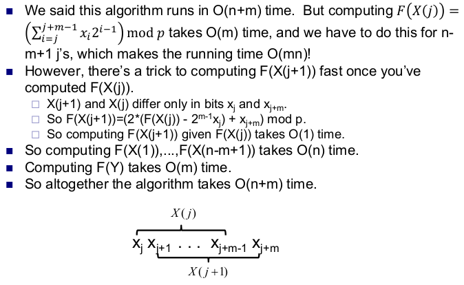

### an **expected** $O(n+m)$ time Las Vegas algorithm

- always gives correct answer


Run the Monte Carlo algorithm.

- If it never produces a match, output “Y doesn’t match X”.

- If it ever outputs a match, say between X(j) and Y, then check X(j)=Y in O(m) time.

  - If $X(j)=Y$, output “Y matches X at bit j”.

  - If $X(j)\ne Y$, start over and run the brute force $O(mn)$ time to match Y to X.

---

## Chernoff Bounds

> 见概率论 Lecture 8
>
> https://en.wikipedia.org/wiki/Chernoff_bound

***Markov’s Inequality***. Given a positive random variable X, $Pr[X\ge a] ≤ E[X]/a$ for any $a> 0$.

***Chebychev’s Inequality***. Given a random variable X and any $a > 0$, we have $Pr[|X-E[X]|\ge a]\le Var[X]/a^2$

***Chernoff’s Inequality***.

### ***Generic Chernoff bounds***

For any r.v. $X$ and constants $a$,
$$
P(X\ge a)\le \inf_{t>0}\frac{E(e^{tX})}{e^{ta}}\\
P(X \le a)\le \inf_{t<0}\frac{E(e^{tX})}{e^{ta}}
$$

### ***Multiplicative Chernoff bound.*** 

Suppose *X*1, ..., *Xn* are [independent](https://en.wikipedia.org/wiki/Statistical_independence) random variables taking values in {0, 1}. Let *X* denote their sum and let $μ = E[X]$ denote the sum's expected value. 

For any $δ > 0$​​,
$$
\displaystyle\Pr(X\ge(1+\delta)\mu)\le \left(\frac{e^{\delta}}{(1+\delta)^{1+\delta}}\right)^\mu
$$
For any $0 < δ < 1$,
$$
\displaystyle\Pr(X\le(1-\delta)\mu)\le \left(\frac{e^{-\delta}}{(1-\delta)^{1-\delta}}\right)^\mu
$$

上述公式在实践中通常不太实用，因此经常使用以下更宽松但更方便的界限，它来自对数不等式列表中的不等式$ {\frac {2\delta }{2+\delta }}\leq \log(1+\delta )$​
$$
\displaystyle \Pr(X\geq (1+\delta )\mu )\leq e^{-\delta ^{2}\mu /(2+\delta )},& 0\leq \delta \\
\displaystyle \Pr(X\leq (1-\delta )\mu )\leq e^{-\delta ^{2}\mu /2},& 0<\delta <1\\
\displaystyle \Pr(|X-\mu |\geq \delta \mu )\leq 2e^{-\delta ^{2}\mu /3},& 0<\delta <1
$$

**Def**. We say an event E occurs ***with high porbability (w.h.p)*** if $\displaystyle\Pr[E]\ge 1-n^{-c}$ for some constant $c>1$.


### Coin flipping

### Load balancing

Suppose we have $n$ computers. A set of $m$​ equal sized jobs arrive online. We need to assign each to a computer for processing.
To make all jobs finish fast, we want to give all computers (almost) same number of jobs. I.e. we want to balance their load.

==**Algorithm**. Given a new job, assign it to a random computer.==

### Set balancing

==**Algorithm**. Assign each set to a random group.==

- the max imbalance is $\sqrt{4m \ln n}$ w.h.p.

---

## Distributed computing

### Contention resolution

- Set of $n$ nodes (e.g. cellphones) want to send each other messages.

- Only one node can send at a time.
- Nodes can’t communicate.
- Assume system is synchronous.
  - Nodes work in rounds.
  - **Each node can try to send once per round. It succeeds if and only if it’s the only node to try to send in that round.**

- Assume system can detect whether this round success (only one node sending)

==**Algorithm**. Each node tries to send with probability $1/n$ in every round.==

#### Analysis

**How many rounds before all the nodes can send?**

Let $S_{i,t}$ be the event that node i successfully sends in t’th round.
$$
Pr(S_{i,t}) = \frac{1}{n} (1- \frac{1}{n})^{n-1}
$$
$\because$ For all $n\ge 2$, $1/e \le (1-1/n)^{n-1} \le½$, and $¼ \le (1-1/n) n \le 1/e$.

$\therefore Pr(S_{i,t}) \ge \frac{1}{en}$

$\therefore Pr(\text{node i fails to send in t’th round})=1-Pr(S_{i,t}) \le 1-\frac{1}{en}$


**Thm.** After $2e*n \ln(n)$ rounds, all nodes succeed sending with probability $\ge1-1/n$ (w.h.p).

**Proof. **Let $F_i$ denote event that node i fails to send after $2e*n \ln(n)$ rounds, and let F denote
event that any node fails to send after $2e*n \ln(n)$ rounds.
$$
Pr(F_i)\le (1-1/en)^{2e*n \ln(n)}\le (1/e)^{2\ln n}\le 1/n^2\\
Pr(F)\le \sum_i Pr(F_i)\le 1/n
$$

---

#### Maximal independent set

Given a graph, an independent set is a set of vertices, none of which are connected to each other.

- ***A maximal independent set (MIS)*** is an independent set such that if we add any other vertex, it would be connected to some vertex in the independent set.

- ***A maximum independent set (MaxIS)*** is an independent set of maximum cardinality in the graph.

- a MiS might not be a MaxIS

### Distributed MIS ==呵呵完全不懂==

**Goal**. Compute an MIS on a network of n nodes.

**A simple algorithm. **continually add a node to the MIS, then remove its neighboring nodes and edges, then repeat.

- $O(n)$ time
- sequential (need to wait when removing the neighbor nodes before selecting the next node)

##### **a fast, distributed MIS algorithm.**

Each node $v$ chooses a random number $r(v)\in [0,1$] and sends it to its neighbors.
- If $r(v)<r(w)$ for all neighbors $w$ of $v$, then $v$ adds itself to the MIS and informs its neighbors.
- If $v$ or one of its neighbors entered the MIS, $v$ terminates. Remove all of $v$’s edges.
- Otherwise go back to first step, until graph is empty.

###### **this algorithm outputs an MIS**.

- The output is an independent set.
- It’s a maximal IS because we only ever take away a node if its neighbor is in the MIS.

###### **this algorithm terminates quickly.**

**Lemma**. In each phase, at least half the edges are removed in expectation.

**Def**. Let u, v be two nodes. Say u preemptively removes v if uN(v), and r(u)<r(u’) for all u’N(u)N(v)\{u}.

**Claim 1**. For any v, there’s at most one u s.t. u<<v.

**Def**. Let P = {all preemptively removed edges in phase}, R = {all edges removed in phase}.

**Claim 2**.  $P\subseteq R$.

**Cor 1**. $\sum_u \sum_{v\in N(u)} X_{u<<v} * d(v) \le 2*|R|$

**Def**. Let $X_{u<<v} =1$ if $u<<v$ and $0$ otherwise. If $X_{u<<v} =1$, all edges incident to $v$ are removed.

**Claim 3**. $\sum_u \sum_{v\in N(u)} X_{u<<v} * d(v) \le 2*|P|$

**Claim 4**. $E[\sum_u \sum_{v\in N(u)} X_{u<<v} *d(v)]\ge |H|$, where H = {edges}.

**Cor 2**. With probability $\ge 1/3$, at least 1/4 the edges get removed in every phase.

**Thm**. The algorithm computes an MIS in $42*ln(n)$ phases with probability $\ge 1-1/n$​.

---

## Linear programming

maximize $4w+3b$ subject to 

- $w+b \le 100$ (land)
- $3w+5b \le 420$ (fertilizer)
- $2w+b \le 160$ (pesticide)

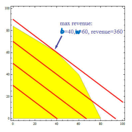

**Key Fact**. The optimum lies at an extreme point (corner).

### Randomized LP in 2D

- The **optimum is defined by two constraints**, the other constraints are redundant

- A constraint is ***tight*** if it the optimum lies on its defining line.

- Let $H$ be set of $n$ constraints. If pick random constraint, there’s only $2/n$​ probability it’s tight.
- Removing a constraint that’s not tight doesn’t change optimum.

For any constraint set $G$, let $B(G)$ denote optimum.

$h \in H$ is redundant iff $B(H)=B(H-\{h\})$.

#### 2D LP algorithm

- If $|H|=2$, output intersection of the 2 halfplanes.

- Pick random constraint $h\in H$.
- Recursively find $opt=B(H-\{h\}).$
- If opt doesn’t violate $h$, output opt.(opt violates h if opt lies outside h.)
- Else project $H-\{h\}$ onto $h$’s boundary to obtain a 1D LP.

- Output the opt of the 1D LP.

**Projection**


#### Time Analysis

Let $T(n)$ be expected time to solve 2D LP with n constraints.
$$
T(n) \le T(n-1)+O(1)+2/n(O(n)+O(1))
\\
T(n) = O(n)
$$

#### Corner cases

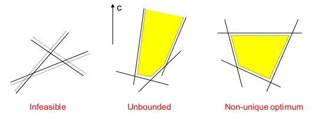

### Higher dimensions

- In $d>2$ dimensions, lines become planes and each constraint corresponds to the space to one side of a plane, called a halfspace.

- Each extreme point (corner) of the polytope is the intersection of $d$ halfspaces.

#### d-Dimensional LP algorithm
- If $|H|=d$, output intersection of the 2 halfplanes.

- Pick random constraint $h\in H$.
- Recursively find $opt=B(H-\{h\}).$
- If opt doesn’t violate $h$, output opt.(opt violates h if opt lies outside h.)
- Else project $H-\{h\}$ onto $h$’s boundary to obtain a $d-1$ dimensional LP.

- Output the opt of the $d-1$ dim LP.

#### Time Analysis

Let $T(n,d)$ be expected time to solve d-dim LP with $n$ constraints.
$$
T(n,d) \le T(n-1,d)+O(d)+d/n(O(dn)+T(n-1,d-1))
\\
T(n,d) = O(d!~n)
$$

---

# Approximation algorithms

Approximation algorithms find an approximately optimal answer.

### Approximation ratio

Let X be a maximization problem. Let A be an algorithm for X. Let $\alpha>1$ be a constant.

- A is an ***$\alpha$-approximation algorithm*** for X if A always returns an answer that’s at least 1/$\alpha$ times the optimal.

- If X is a minimization problem, A is an a-approximation algorithm for X if it always returns an answer that’s at most a times larger than the optimal.

==**the closer $\alpha$​ is to 1, the better the approximation.**==

---

## Set cover

**Input.** A collection $F$ of sets. Each set has a cost. The union of all the sets is $X$.
**Output.** A subset G of F, whose union is $X$.
**Goal.** Minimize the total cost of the sets in $G$.

Minimum cost set cover is NP-complete.
a ==$\ln(n)$-approximation algorithm==, where $n=|X|$

#### A greedy approximation alg

For each set, let c be its cost, and m be the number of points it cover.

Find the most ecomomical set to cover the **remaining** points:

- F is the entire collection of sets. The union of these sets is X.
- Each set S in F has a cost cost(S).
- U is the set of elements of X we haven’t covered yet.
- C is the set cover we eventually output.

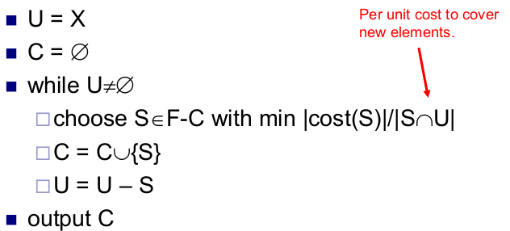

### Proof of correctness

**Def**

- Order the sets in C by when they’re added to C, earliest set first.

- Cost of the set cover is L= S i cost(S i ).
- Order the elements in X by when they’re added, earliest element first.
- Let $n_i$ be the number of new elements $S_i$​ covers.
- Divide the cost of $S_i$ evenly among the new elements it covers.

$\sum_k cost(e_k) = \sum_i cost(S_i) = L$

$cost(e_k)\le OPT / (n-k+1)$

---

## Vertex Cover

**Input.** A graph with vertices $V$ and edges $E$.
**Output.** A subset $V’$ of the vertices, so that every edge in $E$ touches some vertex in $V’$.
**Goal.** Make $|V’|$ as small as possible.

### A vertex cover algorithm

1. Initially, let D be all the edges in the graph, and C be the empty set.
2. Repeat as long as there are edge left in D.
   - Take any edge (u,v) in D.
   - Add {u,v} to C.
   - Remove all the edges adjacent to u or v from D.
3. Output C as the vertex cover.

**==2 approximation==**

### Proof of Correctness

Let C* be an optimal vertex cover.
Let A be the set of edges the algorithm picked.

- None of the edges in A touch each other.
- each vertex in C* covers at most one edge in A.
- Every edge in A is covered by a vertex in C*.
- $|C*|\ge |A|$
- The number of vertices the algorithm uses is $2|A|$​
- So (# vertices alg uses) / (# vertices in opt cover) = $2|A| / |C*|\le 2|A| / |A| = 2$.

---

## Makespan scheduling

- $n$ independent jobs, with different sizes.

- $m$ processors, all with same speed.

- Assign the jobs to the processors.

- Makespan is when the last processor finishes all its jobs.

- Minimize the makespan. 

  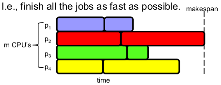

naive: $n!~ C(n+m-1, m-1)$

### Minimizing makespan is NPC

Decision version of the problem on 2 processors is in NP.

**Reduce from SUBSET-SUM problem: **Given a set of numbers $S$ and target $t$, is there a subset of $S$ summing to $t$?

Let $(S,t)$ be an instance of SUBSET-SUM, and let $s$ be sum of all elements in $S$.
Make a set of tasks $J = S\cup \{s-2t\}$, and schedule them on 2 processors

### Graham’s list scheduling

==2-approximation, $O(n \log m)$ time.==

一旦有processor空缺，就把下一个job安排给它

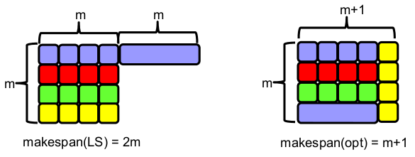

#### Proof

Suppose LS gives makespan of M.
Let the optimal schedule have makespan M*.

Claim 1 $M* \ge t$

Claim 2 $M* \ge T$

$M* \ge \max(T,t)$

$M = T + t$

$M/M* \le (T+t)/\max(T,t) \le 2$

### LPT scheduling

First sort the job according to there size in non-increasing order, then do list scheduling.

4/3-approximation

#### Proof

LPT’s makespan $=T+t \le M^*+t$.


## Traveling Salesman Problem

**Input.** A complete graph with weights on the edges.
**Output**. A cycle that visits each city once.
**Goal**. Find a cycle with minimum total weight.

**NP-hard** to approximate when weights can be arbitrary

**approximable TSP**. A weighted graph satisfies the triangle inequality if for any 3 vertices p, q, r, we have $d_{pq} +d_{qr} \ge d_{pr}$ .

### A 2-approximation for TSP

1. Construct a minimum spanning tree $T$ on $G$.
2. Use depth-first traversal to visit all the vertices in $T$, starting from an arbitrary vertex.
3. Convert this depth-first traversal $T’$ to a cycle $H$ that doesn’t revisit any vertex.
4. Return $H$ as the TSP tour.

**Lemma** If H is the shortcut of $T’$, then $c(H)\le c(T’)$.

#### Proof of 2-approximation

Let H* be an optimum TSP.

Call the path from the depth-first traversal T’.

Since T is an MST, $c(T) \le c(H*)$

$c(T’) = 2 c(T)$

$\therefore c(H) \le c(T’) = 2 c(T) \le 2 c(H*)$

### Christofides 3/2-approx algorithm

A ***matching*** in a graph is a set of non-intersecting edges.

A ***perfect matching*** is a matching that includes every vertex.

An ***Euler tour*** of a graph is a path that starts and ends at the same vertex, and visits every edge once.

**Thm (Euler).** A graph has an Euler tour if and only if all vertices have even degree.

1. Construct a minimum spanning tree $T$ on $G$.
2. Find the set $V’$ of odd degree vertices in $T$.
3. Construct a minimum cost perfect matching $M$ on $V’$.
4. Add $M$ to $T$ to obtain $T’$. (So all nodes in $T$’ have even degree)
5. Find an Euler tour $T’’$ in T’.
6. Shortcut $T’’$ to obtain a Hamiltonian cycle $H$. Output as the TSP

#### Proof

**Lemma.** Let H* be an optimal TSP on G, and let m be the cost of M. Then $m \le c(H^*)/2$

**Thm,** Let H be the TSP output by Christofides and let H* be an optimal TSP. Then c$(H) \le 3/2 ~c(H^*)$.

## k-Center problem

### Gonzalez’s algorithm: 2-approximation

C is set of centers, initially empty.
 repeat
k times
 choose site s with maximum d(s,C)
 add s to C
 return C

#### Proof of correctness

Let C be the algorithm’s output, and r be C’s radius.

**Lemma 1.** For any c,c’C, d(c,c’)r.


## The knapsack problem

### PTAS

Let $\epsilon>0$ be any number. We’ll give a $(1+\epsilon)$- approximation for knapsack.

But the running time will be O(n 3 /e).
